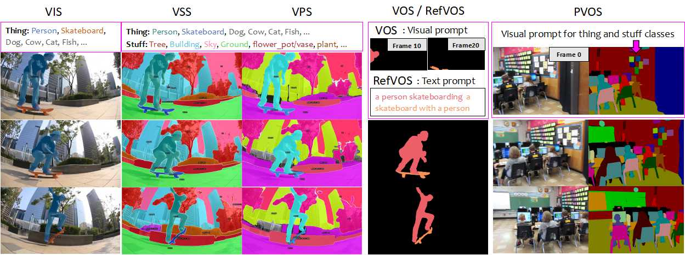
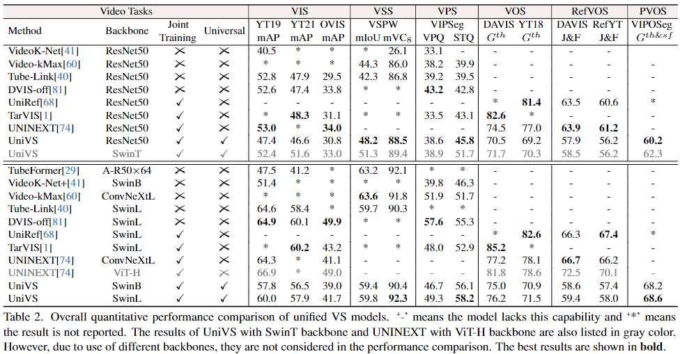

# [UniVS](?): Unified and Universal Video Segmentation with Prompts as Queries

[Minghan LI](https://scholar.google.com/citations?user=LhdBgMAAAAAJ), [Shuai LI](https://scholar.google.com/citations?hl=en&user=Bd73ldQAAAAJ), [Xindong Zhang](https://scholar.google.com/citations?hl=en&user=q76RnqIAAAAJ) and [Lei ZHANG](https://www4.comp.polyu.edu.hk/~cslzhang/)

[[📝 arXiv paper]](?) [[🎥 Video demo in project page]](https://sites.google.com/view/unified-video-seg-univs)

We propose a novel unified VS architecture, namely **UniVS**, by using prompts as queries. For each target of interest, UniVS averages the prompt features stored in the memory pool as its initial query, which is fed to a target-wise prompt cross-attention (ProCA) layer to integrate comprehensive prompt features. On the other hand, by taking the predicted masks of entities as their visual prompts, UniVS can convert different VS tasks into the task of prompt-guided target segmentation, eliminating the heuristic inter-frame matching. 

<div align="center">
  
</div><br/>

## 📌 Updates 📌
* **🔥`Feb-26-2024`:** We released the paper in [ArXiv]().


## 🛠️ Installation 🛠️ 
See [installation instructions](INSTALL.md).

## 👀 Datasets 👀
See [Datasets preparation](./datasets/README.md).

## 🚀 Unified Training and Inference 

### 🌟 Unified Training for Images and Videos 
We provide a script `train_net.py`, that is made to train all the configs provided in UniVS.

Download [pretrained weights of Mask2Former](https://github.com/facebookresearch/Mask2Former/blob/main/MODEL_ZOO.md) and save them into the path `pretrained/m2f_panseg/`, then run the following three stages one by one:
```
sh tools/run/univs_r50_stage1.sh
sh tools/run/univs_r50_stage2.sh
sh tools/run/univs_r50_stage3.sh
```

### 🌟 Unified Inference for videos
Download trained weights from [Model Zoo](Model_zoo.md), and save it into the path `pretrained/stage{1,2,3}/`. We support multiple ways to evaluate UniVS:
```
# test all six tasks using ResNet50 backbone (one-model)
$ sh tools/test/test_r50.sh

# test pvos only using ResNet50, swin-T/B/L backbones
$ sh tools/test/individual_task/test_pvos.sh
```

## 🕹️ Performance on 10 benchmarks
UniVS shows a commendable balance between perfor0mance and universality on 10 challenging VS benchmarks, covering video instance, semantic, panoptic, object, and referring segmentation tasks. 

<div align="center">
  
</div><br/>


## <a name="CitingUniVS"></a>🖊️ Citing UniVS 

If you use UniVS in your research or wish to refer to the baseline results published in the Model Zoo, please use the following BibTeX entry.

```BibTeX
@misc{li2023boxvis,
      title={BoxVIS: Video Instance Segmentation with Box Annotations}, 
      author={Minghan Li, Shuai Li and Lei Zhang},
      year={2024},
      eprint={2303.14618},
      archivePrefix={arXiv},
      primaryClass={cs.CV}
}
```

## 💌 Acknowledgement 

Our code is largely based on [Detectron2](https://github.com/facebookresearch/detectron2), [Mask2Former](https://github.com/facebookresearch/Mask2Former), [VITA](https://github.com/sukjunhwang/VITA), [ReferFormer](https://github.com/wjn922/ReferFormer), [SAM](https://github.com/facebookresearch/segment-anything) and [UniNEXT](https://github.com/MasterBin-IIAU/UNINEXT). We are truly grateful for their excellent work.
